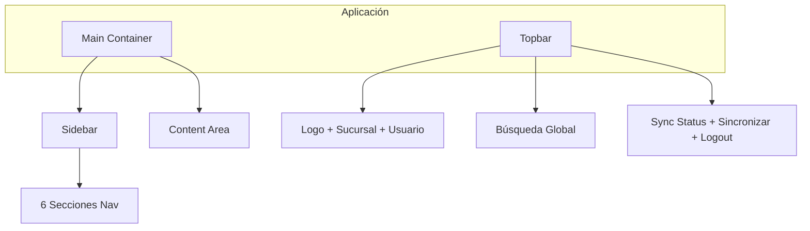
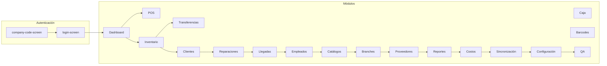

# 00 - Estructura Visual del Sistema POS

Documentación completa de la estructura visual del sistema Opal & Co POS: layout global, pantallas de autenticación, módulos, sub-páginas, tabs y modales.

## 1. Layout Global

**Estructura HTML** (`Sistema/index.html`):

- **Topbar** (header): Logo, `#current-branch`, `#branch-buttons-container`, `#current-user`, `#global-search`, `#topbar-sync-status`, botón sincronizar, botón logout
- **Main Container**: flex row (desktop) o column (móvil ≤768px)
- **Sidebar**: 6 secciones con `nav-section-header` + `nav-section-items`, cada item con `data-module`
- **Content Area** (`#content-area`): Contiene todas las pantallas y módulos; solo uno visible a la vez

---

## 2. Pantallas de Autenticación

### 2.1 Pantalla Código de Empresa (`#company-code-screen`)

- Primera pantalla si no hay `company_code_validated` en localStorage
- Card centrado: logo, título "Acceso Restringido", input password `#company-code-input`, botón Verificar, checkbox "Recordar código"
- Formulario con `id="company-code-form"`

### 2.2 Pantalla Login (`#login-screen`)

- Tras validar código o si ya está validado
- Card: logo, título "Opal & Co", input usuario `#employee-barcode-input`, input PIN `#pin-input`, botón Iniciar Sesión

### 2.3 Overlay Restaurando Sesión (`#session-restore-overlay`)

- Overlay fijo cuando hay `api_token` y se verifica sesión al cargar

---

## 3. Tipos de Módulos: Estáticos vs Dinámicos

| Tipo         | Módulos                                                                                                                       | Contenedor                                  | Contenido                            |
| ------------ | ----------------------------------------------------------------------------------------------------------------------------- | ------------------------------------------- | ------------------------------------ |
| **Estático** | dashboard, barcodes, pos, inventory, qa                                                                                       | `#module-{nombre}` en index.html            | HTML fijo en index                   |
| **Dinámico** | customers, repairs, employees, catalogs, reports, costs, settings, sync, tourist-report, cash, transfers, branches, suppliers | `#module-placeholder` con `#module-content` | JS inyecta HTML en `#module-content` |

**Flujo**: `UI.showModule()` muestra `#module-{nombre}` si existe, sino muestra `#module-placeholder`, actualiza `#module-title` y vacía/usa `#module-content`. Luego `App.loadModule()` llama al init del módulo que pinta su UI.

---

## 4. Módulos con HTML Estático (index.html)

### 4.1 Dashboard (`#module-dashboard`)

- **Header**: h2 "Dashboard", botón Exportar
- **KPI Cards** (grid): Ventas Hoy, Tickets, Ticket Promedio, % Cierre
- **Sección Top Vendedores**: `#top-sellers-list`
- **Sección Alertas**: `#alerts-list`

### 4.2 Códigos de Barras (`#module-barcodes`)

- **Tabs** (5): Resumen, Códigos, Historial, Plantillas, Configuración
- **Contenido**: `#barcodes-content` (inyectado por BarcodesModule)

### 4.3 POS (`#module-pos`)

- **Top bar**: Título "POS - Nueva Venta", reloj, ventas hoy, botones (impresora, favoritos, pendientes, historial, fullscreen, atajos)
- **Dos paneles**:
  - **Izquierdo (Catálogo)**: búsqueda, categorías, filtros avanzados, grid `#pos-products-list`, paginación
  - **Derecho (Checkout)**: Guía/Agencia/Vendedor/Cliente, carrito `#pos-cart-items`, descuentos, totales, métodos de pago (efectivo USD/MXN, TPV, etc.), botón Completar Venta

### 4.4 Inventario (`#module-inventory`)

- **Header**: contador seleccionados, Todo, Eliminar, Nueva Pieza, Alertas, Importar, Exportar, toggle Tarjetas/Lista
- **Estadísticas**: `#inventory-stats` (TOTAL PIEZAS, DISPONIBLES, VALOR, UNIDADES, alertas stock)
- **Filtros**: búsqueda, estado, alerta stock, sucursal, metal, piedra, certificado, costo min/max
- **Lista**: `#inventory-list` (grid o tabla según vista)

### 4.5 Placeholder (`#module-placeholder`)

- Header con `#module-title`
- `#module-content`: contenedor vacío donde módulos dinámicos inyectan su UI

### 4.6 QA (`#module-qa`)

- Header "QA / Autopruebas"
- `#qa-module-content`: contenido inyectado por qa.js (solo admin)

---

## 5. Módulos Dinámicos (Placeholder + module-content)

### 5.1 Clientes (`customers`)

- JS crea: toolbar (buscar, nuevo, exportar, importar, asignar segmento), estadísticas, tabla/lista `#customers-list`
- Modales: Nuevo/Editar Cliente, Confirmar Eliminación, Vista 360°, Exportar, Importar, Asignar Segmento

### 5.2 Reparaciones (`repairs`)

- Lista `#repairs-list`, filtros por estado
- Modales: crear/editar reparación, fotos, completar

### 5.3 Llegadas / Reporte Turistas (`tourist-report`)

- Selector de sucursal y fecha
- Sección llegadas: tabla `#arrivals-table-container`, totales
- Modales: Editar renglón, Override tarifa, Conciliación

### 5.4 Empleados (`employees`)

- **Tabs**: Empleados, Usuarios
- Contenido `#employees-content`: tabla empleados o lista usuarios
- Modales: Nuevo/Editar Empleado, Nuevo/Editar Usuario, Estadísticas, Desempeño, etc.

### 5.5 Catálogos (`catalogs`)

- **Tabs**: Vendedores, Guías, Agencias
- Contenido por tab
- Modales: Nuevo/Editar para cada entidad

### 5.6 Reportes (`reports`)

- **Tabs** (9): Reportes, Comisiones, Resumen, Análisis, Comparativas, Guardados, Historial, Históricos, Captura Rápida
- Contenido `#reports-content`: filtros, botones generar, tablas/gráficos según tab

### 5.7 Costos (`costs`)

- **Tabs** (7): Costos, Llegadas, Recurrentes, Resumen, Análisis, Historial, Presupuestos
- Contenido `#costs-content`

### 5.8 Configuración (`settings`)

- **Tabs principales** (8): General, Impresión, Financiero, Datos maestros, Tabulador Llegadas, Sincronización, Seguridad, Sistema
- **Sub-tabs** por tab (ej. General: Apariencia, Notificaciones; Impresión: Tickets, Etiquetas; etc.)
- Contenido `#settings-content`

### 5.9 Sincronización (`sync`)

- UI de estado: servidor, cola, última sync, botón Sincronizar
- Contenedor `#sync-ui-container`

### 5.10 Caja (`cash`)

- Tarjeta estado `#cash-status-card`, contenedor `#cash-container`
- Modales: Abrir Caja, Cerrar Caja, Movimiento Efectivo, Arqueo Parcial, Utilidad Diaria

### 5.11 Transferencias (`transfers`)

- Lista de transferencias, filtros, botón Nueva Transferencia

### 5.12 Sucursales (`branches`)

- Lista de sucursales (solo admin)

### 5.13 Proveedores (`suppliers`)

- Lista, filtros, CRUD
- Modales: detalles, contactos, etc.

---

## 6. Modales

### 6.1 Modal Genérico (`#modal-overlay`)

- Overlay + `.modal` con `#modal-title`, `#modal-body`, `#modal-footer`
- Usado por `UI.showModal(title, body, footer)`
- Módulos que lo usan: Inventory, POS, Customers, Repairs, Cash, Costs, Settings, Employees, Barcodes, Reports, Dashboard, QA, Suppliers, Tourist Report, etc.

### 6.2 Custom Modals (Utils)

- `Utils.alert()`: custom-modal-alert (icono + mensaje + Aceptar)
- `Utils.confirm()`: custom-modal-confirm (icono warning + mensaje + Cancelar/Aceptar)
- `Utils.prompt()`: custom-modal-prompt (input + Cancelar/Aceptar)
- `Utils.select()`: custom-modal-select (opciones + Cancelar)

---

## 7. Diagrama de Navegación

---

## 8. Resumen de Contenedores Clave

| ID                    | Uso                                               |
| --------------------- | ------------------------------------------------- |
| `#content-area`       | Contenedor principal de todo el contenido         |
| `#module-placeholder` | Usado por módulos dinámicos                       |
| `#module-content`     | Dentro del placeholder; cada módulo inyecta aquí  |
| `#module-title`       | Título del módulo en placeholder                  |
| `#modal-overlay`      | Overlay de modales genéricos                      |
| `#inventory-list`     | Grid/lista de piezas                              |
| `#pos-products-list`  | Grid de productos en POS                          |
| `#pos-cart-items`     | Items del carrito                                 |
| `#reports-content`    | Contenido de la tab activa en Reportes            |
| `#costs-content`      | Contenido de la tab activa en Costos              |
| `#settings-content`   | Contenido de settings                             |
| `#employees-content`  | Contenido de empleados/usuarios                   |
| `#barcodes-content`   | Contenido de códigos de barras                    |
