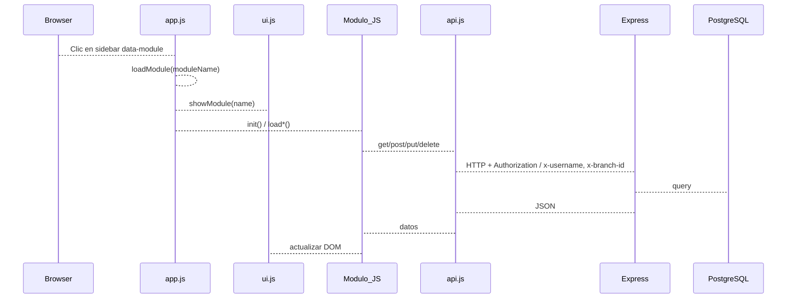

# 01 - Arquitectura

Descripción del stack, flujo general de la aplicación, CORS, Socket.IO y despliegue.

## Stack

- **Frontend**: HTML, CSS (Tailwind vía CDN), JavaScript vanilla. Sin framework; SPA mediante un único `index.html` y módulos JS cargados bajo demanda. Almacenamiento local con IndexedDB (`Sistema/js/db.js`).
- **Backend**: Node.js con Express (ES modules), PostgreSQL como base de datos, Socket.IO para tiempo real.
- **Comunicación**: API REST bajo `/api/*` (JSON), autenticación JWT o headers `x-username` / `x-branch-id`; WebSocket mediante Socket.IO con el mismo criterio de autenticación.

## Flujo general

- La navegación no recarga la página: el sidebar tiene enlaces con `data-module`. `app.js` captura el clic, llama a `loadModule(moduleName)` y a `UI.showModule()`.
- Cada módulo (dashboard, pos, inventory, etc.) se carga en el contenedor `#module-content`; muchos exponen un objeto global (p. ej. `Inventory`, `POS`) con `init()` y métodos de carga de datos.
- Los datos se obtienen vía `API.get/post/put/delete` (definidos en `Sistema/js/api.js`), que usan `baseURL` configurado en Configuración > Sincronización y token en `localStorage` o headers de sucursal/usuario.
- El backend monta las rutas en `backend/server.js`; casi todas usan el middleware `authenticateOptional`, que acepta token JWT o `x-username` + `x-branch-id`.

## CORS y trust proxy

- **CORS**: Configurado en `backend/server.js` (aprox. líneas 51-141). Los orígenes permitidos se leen de `ALLOWED_ORIGINS` o `CORS_ORIGIN` (lista separada por comas). Si está vacío o contiene `*`, se permiten todos los orígenes. Si hay lista, solo esos orígenes son aceptados; las peticiones sin origen (Postman, apps nativas) se permiten. Headers permitidos: `Content-Type`, `Authorization`, `x-username`, `x-branch-id`. Credentials: `true`.
- **Trust proxy**: `app.set('trust proxy', 1)` para que, detrás del proxy de Railway, `req.ip` y rate limiting usen la IP del cliente.
- **OPTIONS**: Hay un handler explícito `app.options('*', ...)` que responde 200 con los headers CORS adecuados para preflight.

Socket.IO usa la misma lista de orígenes (`getAllowedOrigins()`) en su opción `cors.origin`.

## Socket.IO

- **Configuración**: En `server.js` se crea `new Server(httpServer, { cors: { ... }, transports: ['websocket', 'polling'] })`. Se asigna con `app.set('io', io)` para que las rutas puedan emitir eventos.
- **Handlers**: Toda la lógica está en `backend/socket/socketHandler.js`, exportando `setupSocketIO(io)`.
- **Autenticación**: El middleware `io.use(...)` acepta:
  - Token JWT en `socket.handshake.auth.token` o `Authorization`; si es válido, se carga el usuario desde BD y se asigna `socket.user` (incl. `branchId`, `branchIds`, `isMasterAdmin`).
  - Si no hay token válido: `username` (auth.username o header `x-username`) y opcionalmente `branchId` (auth.branchId o header `x-branch-id`). Si el usuario existe en BD se usa; si no, se crea un usuario temporal (p. ej. master_admin o employee).
  - Sin token ni username: conexión anónima (degradada).
- **Salas**: Cada socket se une a `user:${userId}` si hay userId. Master admin se une a `master_admin` y a todas las salas `branch:${id}`, `inventory:${id}`, `sales:${id}`. Usuarios no master se unen solo a `branch:${branchId}` para sus sucursales. Eventos `subscribe_inventory` y `subscribe_sales` permiten unirse a `inventory:${branchId}` y `sales:${branchId}`.
- **Eventos emitidos por el servidor** (helpers en socketHandler):
  - `inventory_updated` (action, item, branchId)
  - `sale_updated` (action, sale, branchId)
  - `branch_updated` (action, branch)
  - `repair_updated`, `customer_updated`, `supplier_updated`, `transfer_updated`, `cost_updated`
  - `emitToBranch(io, branchId, event, data)` y `emitToAll(io, event, data)` para uso genérico.

Las rutas que modifican datos (inventory, sales, branches, repairs, customers, suppliers, transfers, costs) importan estas funciones y las llaman tras crear/actualizar/eliminar.

## Despliegue

- **Backend**: Preparado para Railway (Dockerfile, Procfile, railway.json, nixpacks.toml). Variables importantes: `DATABASE_URL`, `JWT_SECRET`, `ALLOWED_ORIGINS` o `CORS_ORIGIN` (URL del frontend, p. ej. `https://tu-app.vercel.app`). Opcional: `PORT`, `RATE_LIMIT_WINDOW_MS`, `RATE_LIMIT_MAX_REQUESTS`.
- **Frontend**: Carpeta `Sistema/` se puede servir con `npm start` (serve en puerto 3000) o desplegar en Vercel como sitio estático. La URL del API se configura en la app (Configuración > Sincronización) y se guarda en IndexedDB (`settings.api_url`).
- **Health**: `GET /health` (estado y dbConfigured) y `GET /health/db` (comprueba PostgreSQL).

## Archivos clave

| Archivo | Rol |
|---------|-----|
| `backend/server.js` | Express, CORS, rate limit, montaje de rutas, Socket.IO, health. |
| `backend/socket/socketHandler.js` | Auth Socket, salas, helpers de emisión (inventory, sales, branches, etc.). |
| `Sistema/js/app.js` | Inicialización, loadModule, navegación, búsqueda global. |
| `Sistema/js/api.js` | Cliente HTTP y Socket.IO, token, baseURL. |
| `Sistema/index.html` | Layout, topbar, sidebar con data-module, contenedor de módulos. |
