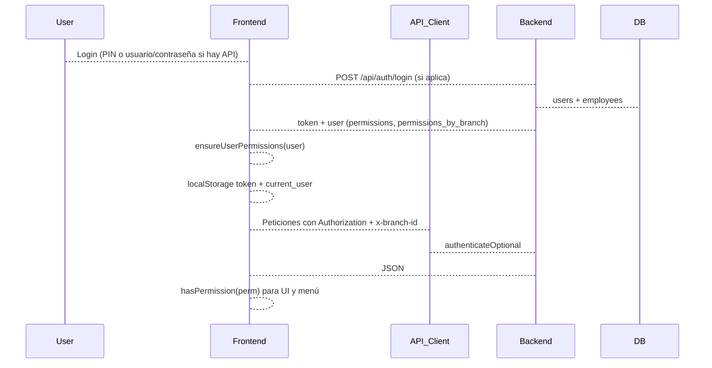

# 03 - Autenticación y permisos

Login JWT, middleware de autenticación (obligatoria y opcional), PermissionManager en el frontend y flujo de usuarios/roles.

## Login (backend)

Archivo: `backend/routes/auth.js`.

- **POST /api/auth/login**: body `username`, `password`. Se busca el usuario en `users` (con JOIN a `employees` para branch_id, branch_ids, role). La contraseña se verifica con bcrypt (hash que empieza por `$2a$`, `$2b$`, `$2y$`) o, en modo legacy, con SHA-256. Se actualiza `last_login`, se genera un JWT (payload: userId, username, role, employeeId; expiración por `JWT_EXPIRES_IN` o 7d) y se registra en `audit_logs`. La respuesta incluye `token` y `user` (id, username, name, role, branchId, branchIds, isMasterAdmin, employeeId, permissions, permissions_by_branch).
- **GET /api/auth/verify**: header `Authorization: Bearer <token>`. Verifica el JWT, carga el usuario desde BD y devuelve `{ valid: true, user }` con la misma estructura de usuario.
- **POST /api/auth/ensure-admin**: crea o asegura el usuario `master_admin` (y empleado ADMIN, sucursal MAIN) con PIN 1234 (bcrypt).
- **POST /api/auth/cleanup-users**: elimina todos los usuarios y vuelve a crear solo `master_admin` (uso interno/mantenimiento).

El frontend guarda el token en `localStorage` (`api_token`) y lo envía en `Authorization: Bearer <token>`. En `Sistema/js/api.js` las peticiones usan ese token cuando está disponible.

## Middleware de autenticación (backend)

### auth.js (autenticación obligatoria)

Archivo: `backend/middleware/auth.js`.

- **authenticateToken**: exige header `Authorization: Bearer <token>`. Verifica JWT con `JWT_SECRET`, carga usuario desde BD y asigna `req.user` (id, username, employeeId, role, branchId, branchIds, isMasterAdmin). Si no hay token o es inválido, responde 401/403.
- **requireMasterAdmin**: comprueba `req.user.isMasterAdmin`; si no, 403.
- **requireBranchAccess**: comprueba que `req.user.branchIds` incluya el branchId de la petición (params/body/query); master_admin bypass. No se usa en las rutas actuales; las rutas usan `authenticateOptional`.

### authOptional.js (autenticación opcional)

Archivo: `backend/middleware/authOptional.js`. Todas las rutas de API (excepto `/api/auth`) usan este middleware.

- **authenticateOptional**:
  1. Si hay header `Authorization: Bearer <token>`: verifica JWT, carga usuario, normaliza UUIDs de sucursal a minúsculas. Calcula `effectiveBranchId` (para master_admin puede venir de header `x-branch-id`; para otros de user.branch_id o user.branch_ids; fallback a header si el usuario no tiene sucursales en BD). Asigna `req.user` con branchId, branchIds, isMasterAdmin, authenticated: true.
  2. Si el token falla o no hay token: intenta por `x-username` (o query/body username) y opcionalmente `x-branch-id`. Si el usuario existe en BD, asigna req.user y comprueba que tenga acceso a la sucursal enviada (si no es master_admin). Si el usuario no existe en BD, crea un usuario temporal (req.user con isTemporary: true, role según username o 'employee').
  3. Si no hay token ni username: req.user anónimo (employee, sin id, branchId desde header si viene).

- **normalizeBranchId**: convierte a string en minúsculas para comparaciones consistentes entre BD y headers.
- **requireMasterAdmin** y **requireBranchAccess**: mismos criterios que en auth.js pero compatibles con req.user de authenticateOptional (incl. usuarios temporales).

El frontend envía en las peticiones al API, cuando hay sesión, el token y/o headers `x-username` y `x-branch-id` (sucursal actual de BranchManager).

## PermissionManager (frontend)

Archivo: `Sistema/js/permission_manager.js`.

- **PERMISSIONS**: objeto por categorías (OPERATIONS, INVENTORY, CUSTOMERS_SERVICES, ADMINISTRATION, REPORTS_ANALYSIS, CONFIGURATION). Cada categoría define constantes de permiso (p. ej. `pos.view`, `inventory.add`, `employees.view`, `reports.view`, `settings.sync`).
- **ROLE_PROFILES**: perfiles predefinidos por rol: admin (all), manager, seller, cashier, employee. Lista de strings de permisos.
- **hasPermission(permission)**:
  - Obtiene el usuario actual desde `UserManager.currentUser` y la sucursal actual desde `BranchManager.getCurrentBranchId()`.
  - Si el usuario es admin o master_admin o tiene `permissions` con 'all', devuelve true.
  - Si el usuario tiene `permissions_by_branch` y para la sucursal actual hay una lista no vacía: si esa lista incluye 'all' o el permiso, devuelve true; si no, hace fallback a permisos globales o rol.
  - Si tiene `permissions` (array) con el permiso o 'all', devuelve true.
  - En último término usa **hasPermissionFromRole(role, permission)** (ROLE_PROFILES).
- **hasAnyPermission(permissions)**, **hasAllPermissions(permissions)**.
- **ensureUserPermissions(user)**: si el usuario es admin, asigna permissions = ['all']. Si no tiene permisos “válidos” (según getAllPermissions), asigna los del perfil del rol y opcionalmente persiste en IndexedDB (users). Usado al hacer login y al restaurar sesión desde servidor o local.
- **getAllPermissions**, **getRolePermissions(role)**, **groupPermissionsByCategory(permissions)**.

Los módulos del frontend ocultan o deshabilitan acciones según `PermissionManager.hasPermission('permiso')`. El menú lateral se filtra con `UI.filterMenuByPermissions()` (según permisos y, en parte, nav-admin-only).

## Users.js y restauración de sesión

Archivo: `Sistema/js/users.js`.

- **Login local (PIN)**: validación contra empleados y usuarios en IndexedDB (por código de empleado y PIN). Tras login exitoso se llama a `PermissionManager.ensureUserPermissions(user)`, se guarda currentUser en localStorage y en memoria, se actualiza BranchManager y UI (updateUserInfo, updateBranchInfo, updateAdminNavigation, filterMenuByPermissions).
- **Restauración al cargar la app**:
  1. Si hay `api_token` en localStorage: se llama a `API.verifyToken()` (GET /api/auth/verify). Si la respuesta es válida, se actualiza currentUser con los datos del servidor (incl. permissions, permissions_by_branch) y se llama a `PermissionManager.ensureUserPermissions(user)`. Se rellenan branch_id/branch_ids desde el empleado o el user. Se oculta login y se muestra el módulo guardado o dashboard.
  2. Si no hay token o falla verify: se intenta restaurar desde `localStorage.current_user`. Se carga el empleado desde IndexedDB y se llama a `PermissionManager.ensureUserPermissions(currentUser)`. Se inicializa BranchManager y se actualiza la UI igual que en el flujo con servidor.
  3. Modo legacy: si hay `current_user_id` en localStorage, se carga el usuario desde IndexedDB y se aplica `ensureUserPermissions` y la misma lógica de branch y UI.

Con esto, tanto al iniciar sesión como al restaurar desde servidor o local, el usuario tiene siempre permisos coherentes (por rol o por permissions/permissions_by_branch) y la sucursal actual está alineada con BranchManager y con los headers que envía el API.

## Resumen de flujo

## Archivos clave

| Archivo | Rol |
|---------|-----|
| `backend/routes/auth.js` | Login, verify, ensure-admin, cleanup-users. |
| `backend/middleware/auth.js` | authenticateToken, requireMasterAdmin, requireBranchAccess (no usados en rutas actuales). |
| `backend/middleware/authOptional.js` | authenticateOptional (usado en todas las rutas /api/* excepto auth), normalización UUID. |
| `Sistema/js/permission_manager.js` | PERMISSIONS, ROLE_PROFILES, hasPermission, ensureUserPermissions. |
| `Sistema/js/users.js` | Login local, restauración desde servidor/localStorage, ensureUserPermissions al restaurar. |
| `Sistema/js/api.js` | Envío de token y headers en peticiones. |
